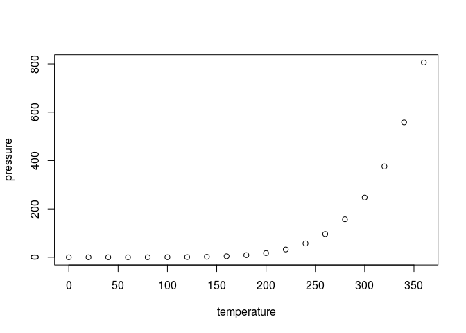

RESULTADOS
==========

1. Autocorrelación de % de carga (calculada a nivel circuito)
-------------------------------------------------------------

-   El input debería ser un dataframe con
-   timestap
-   correlacion

<!-- -->

    summary(cars)

    ##      speed           dist       
    ##  Min.   : 4.0   Min.   :  2.00  
    ##  1st Qu.:12.0   1st Qu.: 26.00  
    ##  Median :15.0   Median : 36.00  
    ##  Mean   :15.4   Mean   : 42.98  
    ##  3rd Qu.:19.0   3rd Qu.: 56.00  
    ##  Max.   :25.0   Max.   :120.00

2. Correlación `voto_PASO` y `porcentaje_de_carga`
--------------------------------------------------

-   El input debería ser un dataframe con
-   timestap
-   partido\_politico
-   correlacion

3. Comparación entre
--------------------

-   El input debería ser un dataframe con
-   timestamp
-   partido\_politico
-   sesgo

4. Gráfico: Evolución `voto_ACTUAL` (por partido)
-------------------------------------------------

-   OPCION 1: El input puede ser un jpg
-   OPCION 2: El input debería ser un dataframe con
-   timestamp
-   partido\_politico
-   voto(suma)

5. Gráfico: Porcentaje de carga por departamento (datos GIS)
------------------------------------------------------------

-   ? Ni idea

6. "Analizar timestams"???
--------------------------

7. Predicción FINAL
-------------------

-   El input debería ser un dataframe con
-   timestamp
-   partido\_politico
-   prediccion
